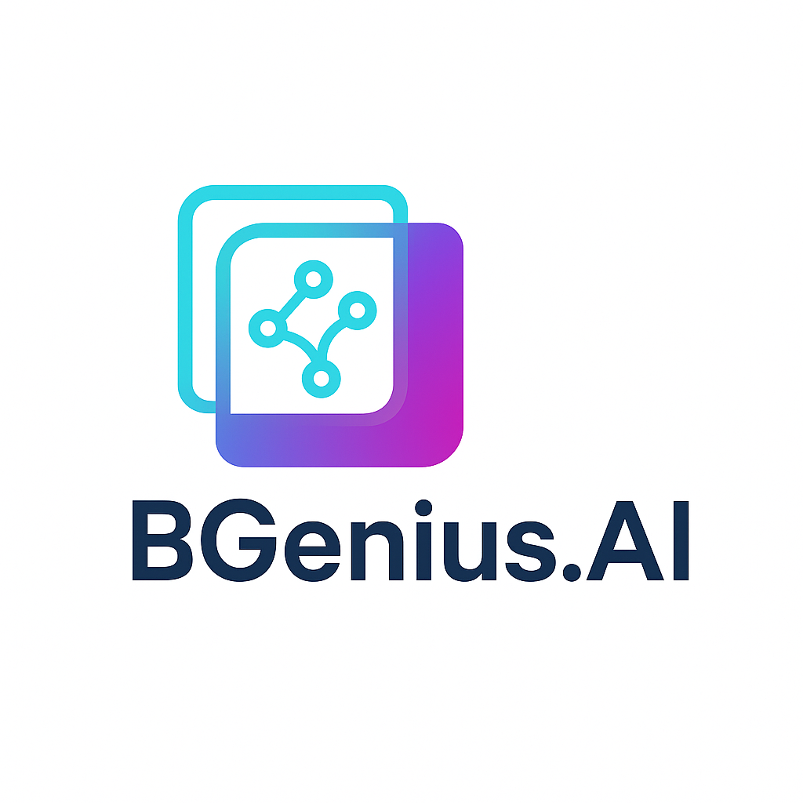

# Background Removal & Generation AI Project (BGenius)

<p align="center">
  
</p>

## [Server here!](https://github.com/dany616/Ai_Image_Optimizer.git)

## Project Overview

BGeniUS is a web application that utilizes TensorFlow.js, BRIA API, and Remove.bg API to remove image backgrounds and generate new backgrounds. The service provides the following three main features:

- **Background Removal**: Automatically removes backgrounds from images.
- **Background Generation**: Replaces removed backgrounds with new ones based on text prompts.
- **One-Click Background Replacement**: Simplifies background removal and generation into a single process.

## System Architecture

This project consists of two main components:

1. **Frontend (Next.js)**: User interface and client-side processing
2. **Backend (FastAPI)**: API processing and database integration

## System Requirements

### Frontend
- Node.js 14.x or higher
- npm or yarn package manager
- Web browser (Latest versions of Chrome, Firefox, Safari)
- Sufficient memory (for TensorFlow.js model loading)

### Backend
- Python 3.8 or higher
- PostgreSQL database
- Sufficient memory and disk space (for image processing)
- Internet connection (for API calls)

## Technology Stack

### Frontend
- [Next.js](https://nextjs.org/) - React framework
- [TypeScript](https://www.typescriptlang.org/) - Statically typed JavaScript
- [TensorFlow.js](https://www.tensorflow.org/js) - Client-side image processing
- [TailwindCSS](https://tailwindcss.com/) - Styling
- [React Dropzone](https://react-dropzone.js.org/) - File upload handling
- [React Icons](https://react-icons.github.io/react-icons/) - Icon set
- [Axios](https://axios-http.com/) - HTTP client

### Backend
- [FastAPI](https://fastapi.tiangolo.com/) - Python API framework
- [SQLAlchemy](https://www.sqlalchemy.org/) - ORM
- [PostgreSQL](https://www.postgresql.org/) - Database
- [AWS S3](https://aws.amazon.com/s3/) - Image storage
- [Pydantic](https://pydantic-docs.helpmanual.io/) - Data validation
- [Uvicorn](https://www.uvicorn.org/) - ASGI server
- [Python-multipart](https://github.com/andrew-d/python-multipart) - File upload handling
- [Pillow](https://python-pillow.org/) - Image processing

## Getting Started

### Frontend Installation and Setup

1. Clone the repository:
```bash
git clone <repository-url>
cd Front/bgenius
```

2. Install dependencies:
```bash
npm install
```

3. Set up environment variables:
Create a `.env.local` file with the following contents:
```
# Backend server configuration
BACKEND_URL=http://localhost:8001

# API key configuration (optional - can also be set on the backend)
BRIA_API_KEY=your_bria_api_key
REMOVE_BG_API_KEY=your_remove_bg_api_key
AWS_ACCESS_KEY_ID=your_aws_access_key_id
AWS_SECRET_ACCESS_KEY=your_aws_secret_access_key
```

4. Run the development server:
```bash
npm run dev
```

5. Access the application at [http://localhost:3000](http://localhost:3000)

### Backend Installation and Setup

1. Navigate to the repository:
```bash
cd Backend_server
```

2. Create and activate a virtual environment:
```bash
python -m venv venv
source venv/bin/activate  # On Windows: venv\Scripts\activate
```

3. Install dependencies:
```bash
pip install -r requirements.txt
```

4. Set up environment variables:
Create a `.env` file with the following contents:
```
# Database
DB_USER=your_db_user
DB_PASSWORD=your_db_password
DB_HOST=localhost
DB_PORT=5432
DB_NAME=ai_photo_db

# API keys
REMOVE_BG_API_KEY=your_remove_bg_api_key
BRIA_API_TOKEN=your_bria_api_token

# AWS S3
AWS_ACCESS_KEY_ID=your_aws_access_key_id
AWS_SECRET_ACCESS_KEY=your_aws_secret_access_key

# File upload settings
MAX_FILE_SIZE=10485760  # 10MB
```

5. Set up the database:
```bash
psql -U postgres
CREATE DATABASE ai_photo_db;
CREATE USER your_db_user WITH ENCRYPTED PASSWORD 'your_db_password';
GRANT ALL PRIVILEGES ON DATABASE ai_photo_db TO your_db_user;
\q
```

6. Run the server:
```bash
python -m uvicorn main:app --host 0.0.0.0 --port 8001 --reload
```

7. Access the API documentation at [http://localhost:8001/docs](http://localhost:8001/docs)

## API Endpoints

The frontend uses the following backend API endpoints:

- **`/api/health`**: Server health check
- **`/api/remove-background`**: Remove image background
- **`/api/background-bria`**: Replace background through BRIA API
- **`/api/background-replace`**: Process background removal and generation in one step
- **`/api/keys`**: API key management

### API Key Management Interface

The backend provides the following API key management endpoints:

- **GET `/api/keys`**: Get a list of currently configured API keys (values are masked)
- **POST `/api/keys`**: Set/update API keys
- **GET `/api/keys/check/{key}`**: Check if a specific API key is set

Through the frontend API key management component, you can manage API keys without restarting the server or modifying the `.env` file.

## API Key Setup

You need API keys from the following services:

### AWS S3
1. Create an AWS account
2. Create an S3 bucket (recommended name 'briadownload', or modify the bucket name in the code)
3. Create an IAM user with S3 access
4. Generate access key and secret key

### BRIA
1. Sign up at [BRIA Platform](https://platform.bria.ai/login)
2. Copy the API token from the Image Generation section

### Remove.bg
1. Sign up at [Remove.bg](https://accounts.kaleido.ai/users/sign_up)
2. Go to My Account → API Keys
3. Click "+ New API Key" to generate and copy the API key

## Project Structure

### Frontend
```
Front/bgenius/
├── app/                   # App router structure
│   ├── api/               # API routes
│   │   ├── generate-background/  # Background generation API
│   │   ├── replace-bg/    # Background replacement API
│   │   └── temp-images/   # Temporary image storage API
│   ├── components/        # React components
│   │   ├── ApiKeyManager.tsx  # API key management component
│   │   └── ... 
│   ├── lib/               # Utility functions
│   ├── pages/             # Page components
│   │   └── upload.tsx     # Upload page
│   └── upload/            # Upload-related components
├── public/                # Static files
│   └── temp-images/       # Temporary image storage
├── .env.local             # Environment variables (not included in Git)
├── .env.example           # Environment variable examples (included in Git)
├── next.config.js         # Next.js configuration
├── package.json           # Dependency management
└── tailwind.config.js     # Tailwind CSS configuration
```

### Backend
```
Backend_server/
├── controller/            # API routers & controllers
│   ├── api_keys.py        # API key management
│   ├── background_bria.py # BRIA background generation
│   ├── background_removal.py # Background removal
│   └── background_replace.py # Background replacement
├── model/                 # Database models
│   ├── database.py        # DB configuration
│   └── user_db.py         # User model
├── uploads/               # Uploaded image storage
├── config/                # Configuration files
├── .env                   # Environment variables (not included in Git)
├── main.py                # Application entry point
└── config.py              # Configuration management
```

## GitHub Checklist

### .gitignore Setup

Make sure the following items are included in your `.gitignore`:

```
# Environment variables and sensitive information
.env
.env.local
.env.development.local
.env.test.local
.env.production.local

# Development files
node_modules/
.next/
*.log
logs/
npm-debug.log*
yarn-debug.log*
yarn-error.log*

# System files
.DS_Store
Thumbs.db

# Temporary files
public/temp-images/
uploads/
uploads/bg_results/

# IDE settings
.idea/
.vscode/
*.swp
*.swo
```

## Security Considerations

1. Store API keys, database credentials, and other sensitive information only in `.env`/`.env.local` files and never commit them to Git.
2. Always include environment variable files in `.gitignore`.
3. Never commit AWS credentials to a public repository.
4. Use the web interface to manage API keys (provided by the backend).
5. Add proper authentication and authorization to all API endpoints when deploying to production.
6. Use HTTPS to encrypt data transmission.

## Main Dependencies

The main frontend dependencies include:
- next: 14.1.0
- react: 18.2.0
- react-dom: 18.2.0
- @tensorflow/tfjs: 4.15.0
- @tensorflow-models/body-pix: 2.2.0
- axios: 1.6.7
- react-dropzone: 14.3.8
- react-icons: 5.0.1
- tailwindcss: 3.4.1
- typescript: 5.x

For the complete list, refer to the `package.json` file.

## License

This project is licensed under the MIT License.

## Contact

If you encounter any issues or have questions, please submit an issue.

---

# 배경 제거 및 생성 AI 프로젝트 (BGenius)

<p align="center">
  
</p>

## [서버는 여기!](https://github.com/dany616/Ai_Image_Optimizer.git)

## 프로젝트 개요

BGeniUS는 TensorFlow.js, BRIA API, Remove.bg API를 활용하여 이미지 배경을 제거하고 새로운 배경을 생성하는 웹 애플리케이션입니다. 이 서비스는 다음과 같은 세 가지 주요 기능을 제공합니다:

- **배경 제거**: 이미지에서 배경을 자동으로 제거합니다.
- **배경 생성**: 텍스트 프롬프트를 기반으로 제거된 배경을 새로운 배경으로 교체합니다.
- **원클릭 배경 교체**: 배경 제거와 생성을 하나의 프로세스로 간소화합니다.

## 시스템 아키텍처

이 프로젝트는 두 개의 주요 구성 요소로 이루어져 있습니다:

1. **프론트엔드 (Next.js)**: 사용자 인터페이스 및 클라이언트 측 처리
2. **백엔드 (FastAPI)**: API 처리 및 데이터베이스 통합

## 시스템 요구사항

### 프론트엔드
- Node.js 14.x 이상
- npm 또는 yarn 패키지 관리자
- 웹 브라우저 (Chrome, Firefox, Safari 최신 버전)
- 충분한 메모리 (TensorFlow.js 모델 로딩용)

### 백엔드
- Python 3.8 이상
- PostgreSQL 데이터베이스
- 충분한 메모리와 디스크 공간 (이미지 처리용)
- 인터넷 연결 (API 호출용)

## 기술 스택

### 프론트엔드
- [Next.js](https://nextjs.org/) - React 프레임워크
- [TypeScript](https://www.typescriptlang.org/) - 정적 타입 JavaScript
- [TensorFlow.js](https://www.tensorflow.org/js) - 클라이언트 측 이미지 처리
- [TailwindCSS](https://tailwindcss.com/) - 스타일링
- [React Dropzone](https://react-dropzone.js.org/) - 파일 업로드 처리
- [React Icons](https://react-icons.github.io/react-icons/) - 아이콘 세트
- [Axios](https://axios-http.com/) - HTTP 클라이언트

### 백엔드
- [FastAPI](https://fastapi.tiangolo.com/) - Python API 프레임워크
- [SQLAlchemy](https://www.sqlalchemy.org/) - ORM
- [PostgreSQL](https://www.postgresql.org/) - 데이터베이스
- [AWS S3](https://aws.amazon.com/s3/) - 이미지 저장소
- [Pydantic](https://pydantic-docs.helpmanual.io/) - 데이터 검증
- [Uvicorn](https://www.uvicorn.org/) - ASGI 서버
- [Python-multipart](https://github.com/andrew-d/python-multipart) - 파일 업로드 처리
- [Pillow](https://python-pillow.org/) - 이미지 처리

## 시작하기

### 프론트엔드 설치 및 설정

1. 저장소 클론:
```bash
git clone <repository-url>
cd Front/bgenius
```

2. 의존성 설치:
```bash
npm install
```

3. 환경 변수 설정:
다음 내용으로 `.env.local` 파일을 생성하세요:
```
# 백엔드 서버 설정
BACKEND_URL=http://localhost:8001

# API 키 설정 (선택사항 - 백엔드에서도 설정 가능)
BRIA_API_KEY=your_bria_api_key
REMOVE_BG_API_KEY=your_remove_bg_api_key
AWS_ACCESS_KEY_ID=your_aws_access_key_id
AWS_SECRET_ACCESS_KEY=your_aws_secret_access_key
```

4. 개발 서버 실행:
```bash
npm run dev
```

5. [http://localhost:3000](http://localhost:3000)에서 애플리케이션에 접근하세요

### 백엔드 설치 및 설정

1. 저장소로 이동:
```bash
cd Backend_server
```

2. 가상 환경 생성 및 활성화:
```bash
python -m venv venv
source venv/bin/activate  # Windows의 경우: venv\Scripts\activate
```

3. 의존성 설치:
```bash
pip install -r requirements.txt
```

4. 환경 변수 설정:
다음 내용으로 `.env` 파일을 생성하세요:
```
# 데이터베이스
DB_USER=your_db_user
DB_PASSWORD=your_db_password
DB_HOST=localhost
DB_PORT=5432
DB_NAME=ai_photo_db

# API 키
REMOVE_BG_API_KEY=your_remove_bg_api_key
BRIA_API_TOKEN=your_bria_api_token

# AWS S3
AWS_ACCESS_KEY_ID=your_aws_access_key_id
AWS_SECRET_ACCESS_KEY=your_aws_secret_access_key

# 파일 업로드 설정
MAX_FILE_SIZE=10485760  # 10MB
```

5. 데이터베이스 설정:
```bash
psql -U postgres
CREATE DATABASE ai_photo_db;
CREATE USER your_db_user WITH ENCRYPTED PASSWORD 'your_db_password';
GRANT ALL PRIVILEGES ON DATABASE ai_photo_db TO your_db_user;
\q
```

6. 서버 실행:
```bash
python -m uvicorn main:app --host 0.0.0.0 --port 8001 --reload
```

7. [http://localhost:8001/docs](http://localhost:8001/docs)에서 API 문서에 접근하세요

## API 엔드포인트

프론트엔드는 다음 백엔드 API 엔드포인트를 사용합니다:

- **`/api/health`**: 서버 상태 확인
- **`/api/remove-background`**: 이미지 배경 제거
- **`/api/background-bria`**: BRIA API를 통한 배경 교체
- **`/api/background-replace`**: 배경 제거 및 생성을 한 번에 처리
- **`/api/keys`**: API 키 관리

### API 키 관리 인터페이스

백엔드는 다음 API 키 관리 엔드포인트를 제공합니다:

- **GET `/api/keys`**: 현재 설정된 API 키 목록 가져오기 (값은 마스킹됨)
- **POST `/api/keys`**: API 키 설정/업데이트
- **GET `/api/keys/check/{key}`**: 특정 API 키가 설정되어 있는지 확인

프론트엔드 API 키 관리 컴포넌트를 통해 서버를 재시작하거나 `.env` 파일을 수정하지 않고도 API 키를 관리할 수 있습니다.

## API 키 설정

다음 서비스들로부터 API 키가 필요합니다:

### AWS S3
1. AWS 계정 생성
2. S3 버킷 생성 (권장 이름: 'briadownload', 또는 코드에서 버킷 이름 수정)
3. S3 접근 권한을 가진 IAM 사용자 생성
4. 액세스 키 및 시크릿 키 생성

### BRIA
1. [BRIA Platform](https://platform.bria.ai/login)에서 회원가입
2. Image Generation 섹션에서 API 토큰 복사

### Remove.bg
1. [Remove.bg](https://accounts.kaleido.ai/users/sign_up)에서 회원가입
2. My Account → API Keys로 이동
3. "+ New API Key"를 클릭하여 API 키 생성 및 복사

## 프로젝트 구조

### 프론트엔드
```
Front/bgenius/
├── app/                   # 앱 라우터 구조
│   ├── api/               # API 라우트
│   │   ├── generate-background/  # 배경 생성 API
│   │   ├── replace-bg/    # 배경 교체 API
│   │   └── temp-images/   # 임시 이미지 저장 API
│   ├── components/        # React 컴포넌트
│   │   ├── ApiKeyManager.tsx  # API 키 관리 컴포넌트
│   │   └── ... 
│   ├── lib/               # 유틸리티 함수
│   ├── pages/             # 페이지 컴포넌트
│   │   └── upload.tsx     # 업로드 페이지
│   └── upload/            # 업로드 관련 컴포넌트
├── public/                # 정적 파일
│   └── temp-images/       # 임시 이미지 저장소
├── .env.local             # 환경 변수 (Git에 포함되지 않음)
├── .env.example           # 환경 변수 예시 (Git에 포함됨)
├── next.config.js         # Next.js 설정
├── package.json           # 의존성 관리
└── tailwind.config.js     # Tailwind CSS 설정
```

### 백엔드
```
Backend_server/
├── controller/            # API 라우터 및 컨트롤러
│   ├── api_keys.py        # API 키 관리
│   ├── background_bria.py # BRIA 배경 생성
│   ├── background_removal.py # 배경 제거
│   └── background_replace.py # 배경 교체
├── model/                 # 데이터베이스 모델
│   ├── database.py        # DB 설정
│   └── user_db.py         # 사용자 모델
├── uploads/               # 업로드된 이미지 저장소
├── config/                # 설정 파일
├── .env                   # 환경 변수 (Git에 포함되지 않음)
├── main.py                # 애플리케이션 진입점
└── config.py              # 설정 관리
```

## GitHub 체크리스트

### .gitignore 설정

`.gitignore`에 다음 항목들이 포함되어 있는지 확인하세요:

```
# 환경 변수 및 민감한 정보
.env
.env.local
.env.development.local
.env.test.local
.env.production.local

# 개발 파일
node_modules/
.next/
*.log
logs/
npm-debug.log*
yarn-debug.log*
yarn-error.log*

# 시스템 파일
.DS_Store
Thumbs.db

# 임시 파일
public/temp-images/
uploads/
uploads/bg_results/

# IDE 설정
.idea/
.vscode/
*.swp
*.swo
```

## 보안 고려사항

1. API 키, 데이터베이스 자격 증명 및 기타 민감한 정보는 `.env`/`.env.local` 파일에만 저장하고 Git에 커밋하지 마세요.
2. 환경 변수 파일을 항상 `.gitignore`에 포함하세요.
3. AWS 자격 증명을 공개 저장소에 커밋하지 마세요.
4. API 키 관리를 위해 웹 인터페이스를 사용하세요 (백엔드에서 제공).
5. 프로덕션 배포 시 모든 API 엔드포인트에 적절한 인증 및 권한 부여를 추가하세요.
6. 데이터 전송을 암호화하기 위해 HTTPS를 사용하세요.

## 주요 의존성

주요 프론트엔드 의존성은 다음과 같습니다:
- next: 14.1.0
- react: 18.2.0
- react-dom: 18.2.0
- @tensorflow/tfjs: 4.15.0
- @tensorflow-models/body-pix: 2.2.0
- axios: 1.6.7
- react-dropzone: 14.3.8
- react-icons: 5.0.1
- tailwindcss: 3.4.1
- typescript: 5.x

전체 목록은 `package.json` 파일을 참조하세요.

## 라이선스

이 프로젝트는 MIT 라이선스 하에 라이선스됩니다.

## 문의

문제가 발생하거나 질문이 있으시면 이슈를 제출해 주세요.
